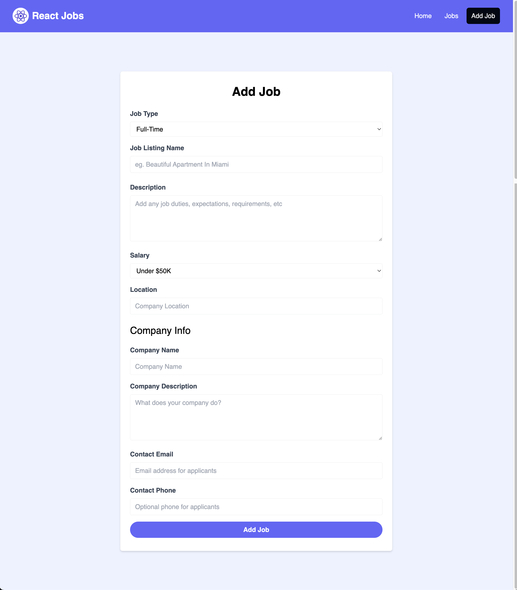
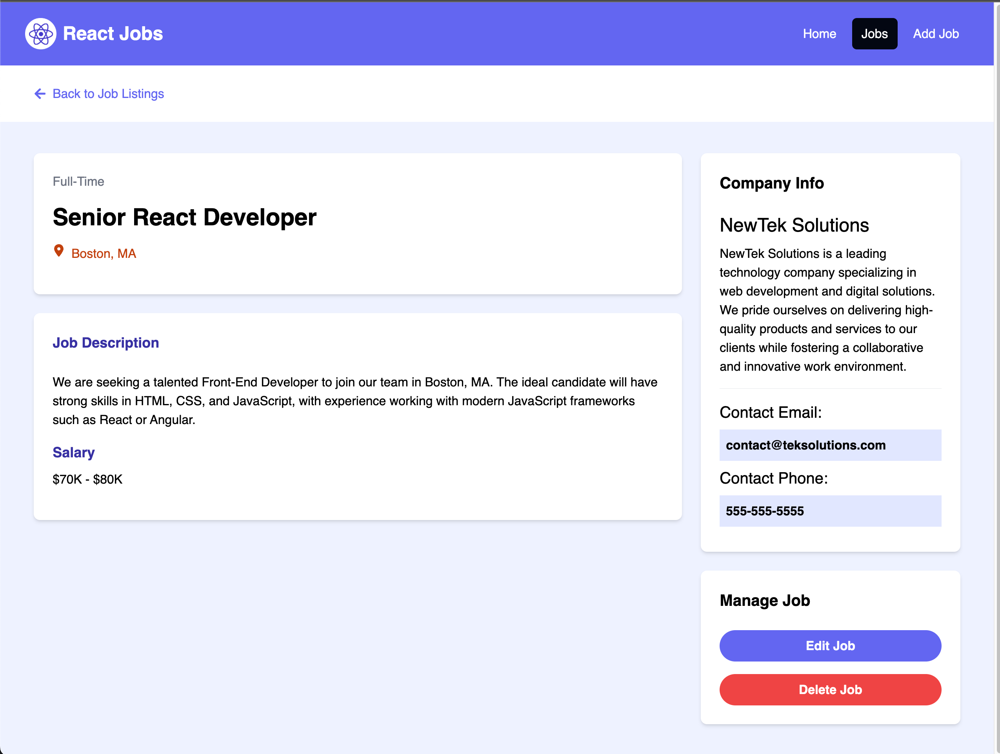

# React Jobs CRUD APP


This app allows to make CRUD operations for a Job

 - First create a json-server for the API calls using the ```npm run server``` and then open a separate terminal window to run ```npm run dev```

#### Homepage:


#### Add Job Page:


#### View Job Page:
